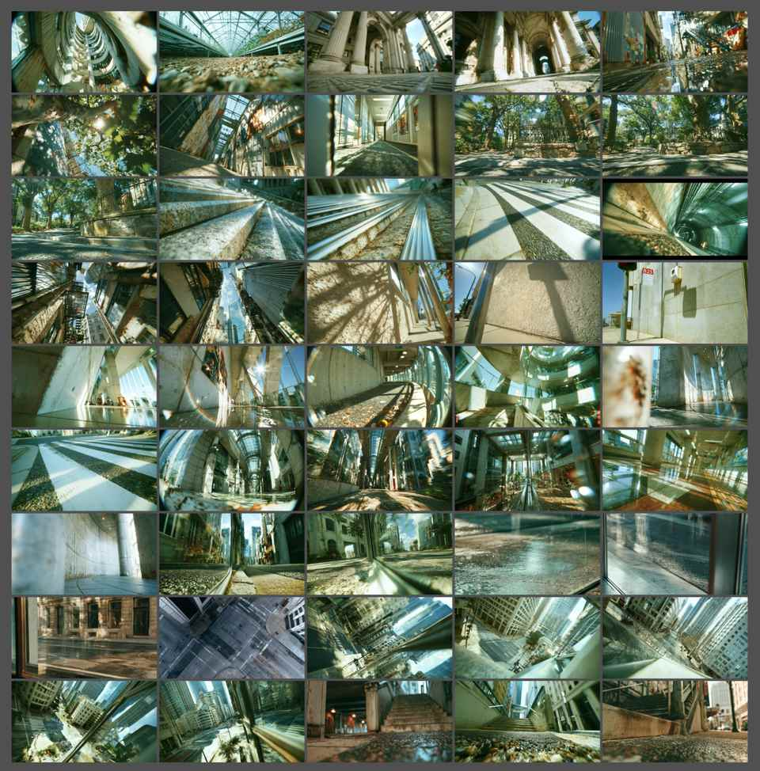
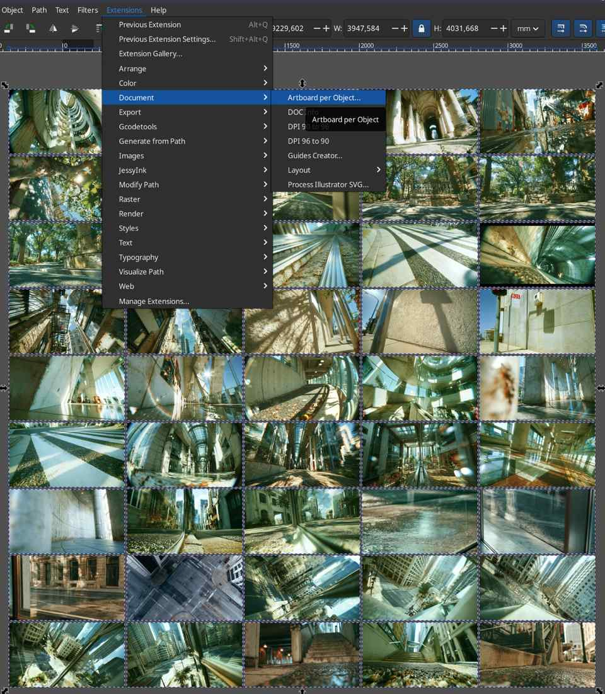
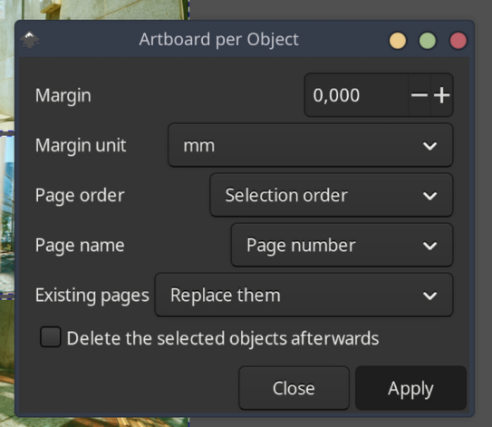
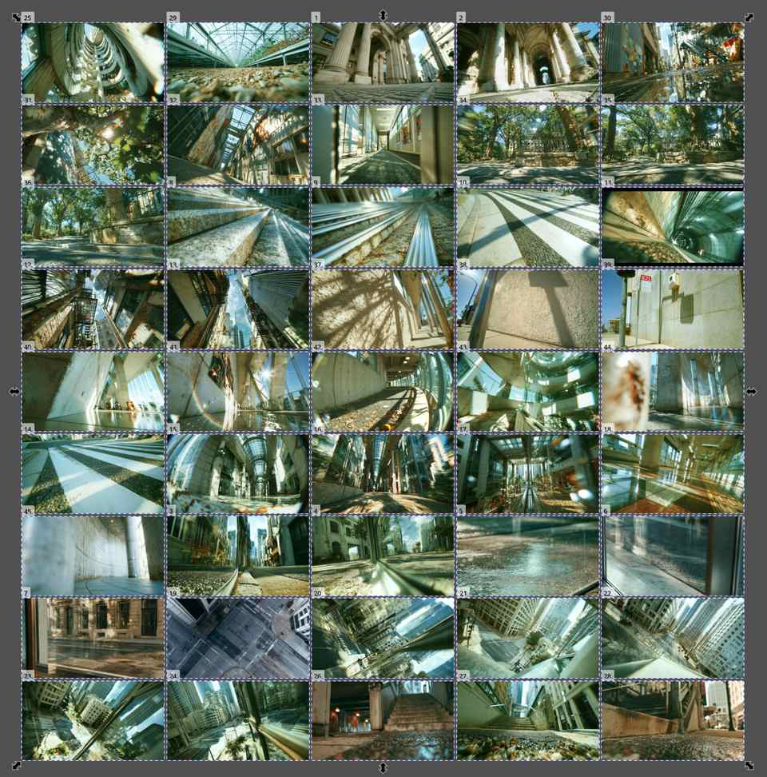

# Artboard per Object

An Inkscape extension that creates one page for each selected object.

The pages stay where the objects already are. Each page is that object's visual bounding box, stroke included, plus an optional margin.



## Install

Inkscape 1.2 or newer. Pages were added in 1.2. This extension was made with 1.4.

```bash
mkdir -p ~/.config/inkscape/extensions
git clone https://github.com/davidbrum25/inkscape-artboard-per-object.git \
  ~/.config/inkscape/extensions/artboard-per-object
```

Restart Inkscape. The command is **Extensions → Document → Artboard per Object**.

On Windows the extensions folder is `%APPDATA%\inkscape\extensions`.

## Use

1. Select the objects that should become pages. A group counts as one object.
2. Open **Extensions → Document → Artboard per Object**.
3. Apply.







## Options

| Option | What it does |
| --- | --- |
| Margin | Space added on every side of each object. A negative value shrinks the page. |
| Margin unit | mm, cm, in, pt, CSS pixels, or SVG user units (the same coordinates the page uses). |
| Page order | Selection order, rows from left to right, or columns from top to bottom. |
| Page name | The object's name, its id, or a page number. A repeated name gets a suffix, so a second `Icon` becomes `Icon 2`. |
| Existing pages | Keep the pages already in the file, or replace them. On a normal one-page file, keeping them also keeps that original page. |
| Delete the selected objects afterwards | Off by default, so the artwork stays on the new pages. Turn it on when the selection was only rectangles used to mark where the pages should be. |

An object with no bounding box, such as an empty group, is skipped.

## License

[GPL-2.0-or-later](LICENSE). Same license family as Inkscape's own extensions.
